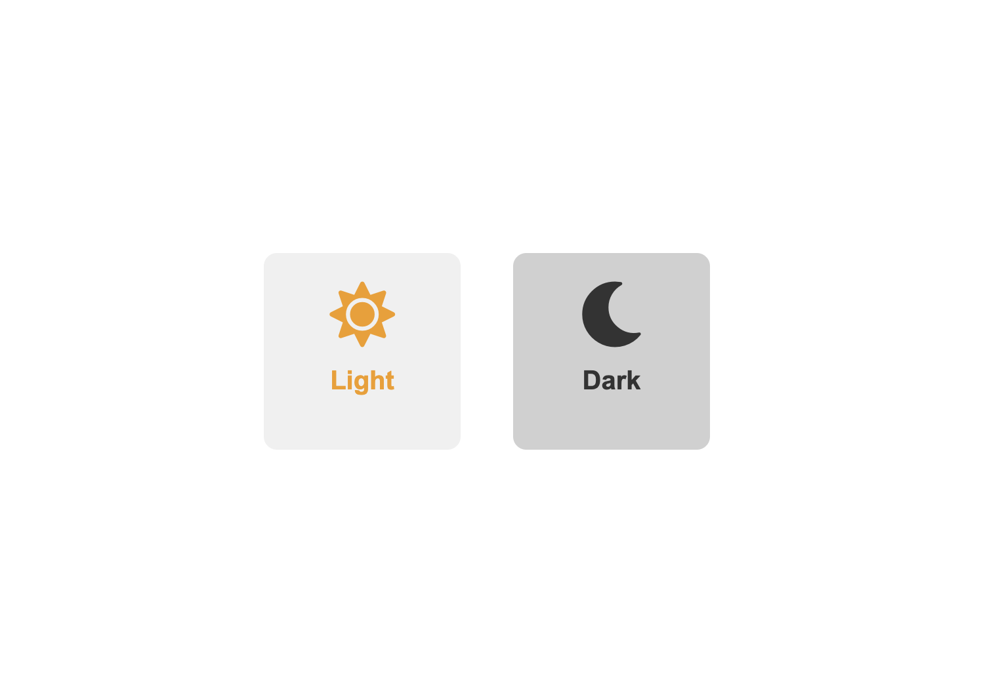

# [Ir a Version en Español](readme_es.md)

# Light/Dark Mode Toggle with SMACSS
This project demonstrates a simple light/dark mode toggle using HTML, CSS (organized with SMACSS), JavaScript, Font Awesome for icons, and Bootstrap for layout.





## Table of Contents
- [Introduction](#introduction)
- [Project Structure](#project-structure)
- [Technologies Used](#technologies-used)
- [Setup](#setup)
- [Usage](#usage)
- [Customization](#customization)
- [Contributing](#contributing)
- [License](#license)

## Introduction
This project showcases a web page with two centered boxes: one indicating "Light" with a sun icon, and the other indicating "Dark" with a moon icon. Clicking on either box toggles the page between light and dark mode.

## Project Structure
The project follows the SMACSS (Scalable and Modular Architecture for CSS) methodology, organizing CSS into different categories.

```
/project
|-- index.html
|-- css
|   |-- base.css
|   |-- layout.css
|   |-- module.css
|   |-- state.css
|   |-- theme.css
```
## Technologies Used
- HTML
- CSS (with SMACSS methodology)
- JavaScript
- Font Awesome (for icons)
- Bootstrap (for layout)

## Setup
To set up this project locally, follow these steps:

1. Clone the repository:
```sh
git clone https://github.com/Giovasdf/light-dark-mode-toggle
```
2. Navigate to the project directory:
```sh
cd light-dark-mode-toggle
```
## Usage
Open index.html in your web browser to view the light/dark mode toggle functionality.

### JavaScript Explanation
The JavaScript toggles the theme-dark and theme-light classes on the body element to switch between themes.

``` javascript
<script>
    function toggleMode(mode) {
            if (mode === 'light' && document.body.classList.contains('theme-dark')) {
                document.body.classList.remove('theme-dark');
                document.body.classList.add('theme-light');
            } else if (mode === 'dark' && document.body.classList.contains('theme-light')) {
                document.body.classList.remove('theme-light');
                document.body.classList.add('theme-dark');
            }
            updateButtons();
        }

        function updateButtons() {
            if (document.body.classList.contains('theme-light')) {
                document.getElementById('light-mode').classList.add('disabled');
                document.getElementById('dark-mode').classList.remove('disabled');
            } else if (document.body.classList.contains('theme-dark')) {
                document.getElementById('dark-mode').classList.add('disabled');
                document.getElementById('light-mode').classList.remove('disabled');
            }
        }
</script>
```
## Customization
You can customize the appearance and behavior of the light/dark mode toggle by modifying the CSS files. Each CSS file is organized according to the SMACSS methodology:

- base.css: Global styles and default settings.
- layout.css: Layout-related styles.
- module.css: Styles for individual components.
- state.css: Styles for various states (e.g., hover, active).
- theme.css: Theme-specific styles (e.g., light and dark modes).

## Contributing
Contributions are welcome! If you have suggestions or improvements, please create an issue or submit a pull request.

## License
This project is licensed under the MIT License. 